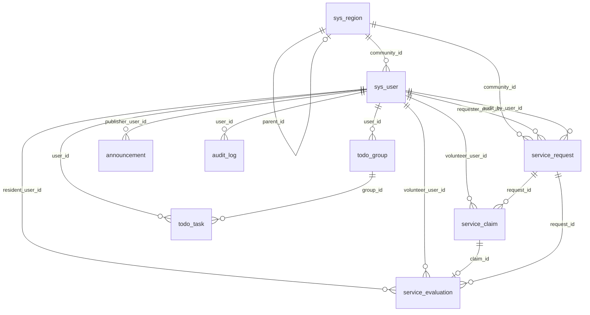

# 社区公益服务对接管理平台 — 数据库设计说明

> 数据库名建议：`community_service`  
> 引擎：MySQL 8.0，字符集 `utf8mb4`  
> 主 DDL 源文件：`src/main/resources/db/schema.sql`  
> 补丁脚本（按需执行）：同目录下 `service_request_emergency.sql`、`sys_region_province_city.sql` 等

---

## 一、表清单与业务含义

| 表名 | 说明 |
|------|------|
| `sys_region` | 区域/网格树（区→街道→社区）；含省、市展示字段；`parent_id` 自关联 |
| `sys_user` | 用户（超管/社区管理员/普通用户）；`community_id` 逻辑关联 `sys_region` |
| `service_request` | 公益服务需求（发布、审核、状态流转） |
| `service_claim` | 志愿者认领记录及时长 |
| `service_evaluation` | 居民对已完成服务的评价（与认领记录一对一） |
| `announcement` | 社区公告（富文本、推送范围） |
| `sys_config` | 系统参数（JSON，如基础配置/短信模板/告警阈值） |
| `backup_record` | 备份/恢复/导出操作记录 |
| `support_like` | 全局点赞计数（单表一行或按需扩展） |
| `todo_group` | 用户待办分组 |
| `todo_task` | 待办任务 |
| `audit_log` | 管理端操作审计日志 |

---

## 二、外键关系（schema.sql 中已声明的约束）

| 子表 | 外键列 | 引用表 | 引用列 |
|------|--------|--------|--------|
| `service_request` | `requester_user_id` | `sys_user` | `id` |
| `service_request` | `audit_by_user_id` | `sys_user` | `id` |
| `service_claim` | `request_id` | `service_request` | `id` |
| `service_claim` | `volunteer_user_id` | `sys_user` | `id` |
| `service_evaluation` | `claim_id` | `service_claim` | `id` |
| `service_evaluation` | `request_id` | `service_request` | `id` |
| `service_evaluation` | `resident_user_id` | `sys_user` | `id` |
| `service_evaluation` | `volunteer_user_id` | `sys_user` | `id` |

## 三、逻辑关联（未建外键，论文/ER 中建议画出）

| 来源表.列 | 含义 | 关联目标 |
|-----------|------|----------|
| `sys_user.community_id` | 用户绑定社区 | `sys_region.id`（通常 `level=3`） |
| `service_request.community_id` | 需求所属社区 | `sys_region.id` |
| `announcement.target_community_id` | 公告推送社区 | `sys_region.id` |
| `announcement.publisher_user_id` | 发布人 | `sys_user.id` |
| `sys_region.parent_id` | 上级区域 | `sys_region.id`（树形） |
| `todo_group.user_id` | 分组所属用户 | `sys_user.id` |
| `todo_task.user_id` / `group_id` | 任务归属 | `sys_user.id` / `todo_group.id` |
| `audit_log.user_id` | 操作人 | `sys_user.id`（可空） |

---

## 四、核心业务流程与表协作（文字版）

1. **居民**（`sys_user`）在 **`service_request`** 发布需求，填写地址、紧急联系人等。  
2. **社区管理员**审核：`audit_by_user_id`、`status`、驳回原因等。  
3. **志愿者**在 **`service_claim`** 认领 `service_request`，完成后填写 **`service_hours`**。  
4. **居民**在 **`service_evaluation`** 对对应 **`claim_id`** 评价（唯一约束保证一条认领一条评价）。  
5. **网格/展示**：用户与需求上的 **`community_id`** 与 **`sys_region`** 对应；**`province` / `city`** 仅展示用。

---

## 五、Mermaid ER 图（可粘贴到 Typora、Notion、[Mermaid Live Editor](https://mermaid.live)）

> 下图包含**外键 + 常用逻辑关联**。导出 PNG/SVG：在 Mermaid Live 中渲染后导出。

---

## 六、如何生成正式 ER 图（工具建议）

1. **MySQL Workbench**  
   - `Database` → `Reverse Engineer…` 连接本机库，选择 `community_service`，生成 EER 图。  
   - 需已按 `schema.sql` 建库。

2. **Navicat / DataGrip**  
   - 连接数据库 → 逆向数据库到模型 / ER 图，导出 PDF 或图片。

3. **dbdiagram.io**  
   - 打开项目内 `docs/schema-for-er.dbml`，复制到网站编辑器，即可生成可导出的 ER 图。

4. **仅用 SQL**  
   - 使用 `docs/schema-clean-for-er.sql`（无 DROP、无动态语句）导入空库后，再用上述工具逆向。

---

## 七、文件索引

| 文件 | 用途 |
|------|------|
| `src/main/resources/db/schema.sql` | 完整建表脚本（权威） |
| `docs/schema-for-er.dbml` | 在线 ER 工具（DBML） |
| `docs/schema-clean-for-er.sql` | 适合导入后再逆向的精简 DDL |
| `docs/database-design.md` | 本说明（论文「数据库设计」章节素材） |
