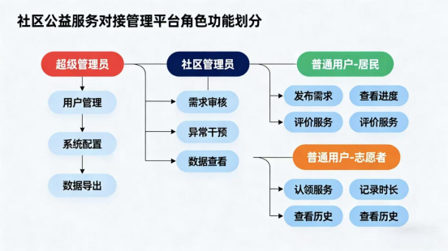
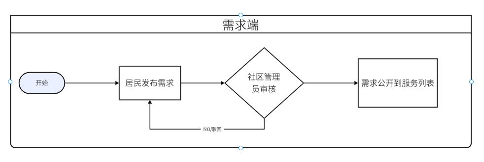
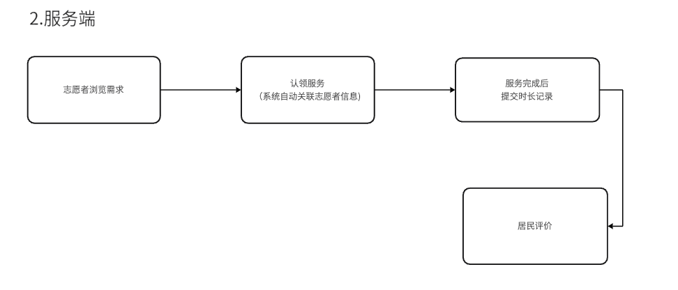

**基于 "十五五" 规划的社区公益服务对接管理平台**

**一、项目背景与意义**

“十五五”规划明确提出“健全基层社会治理体系，推动公益服务精准化、智能化供给”，将社区作为民生服务与社会治理的核心载体，要求破解公益资源分散、供需匹配低效等痛点。当前社区公益普遍存在“需求难精准捕捉、资源难高效对接、服务难跟踪评估”的问题，例如老人助餐需求与志愿者供给错配、公益活动参与率低等，难以适配规划中“民生服务提质增效”的要求。

本社区公益服务对接管理系统，正是响应“十五五”“以数字化赋能基层治理”的号召，通过搭建系统化平台打通公益服务“需求-资源-监管”全链路，既解决传统公益“信息孤岛”问题，又为社区治理数字化转型提供可落地的工具，助力构建更具韧性的基层民生服务体系。

**二、核心模块**

**1**. **用户与权限模块**

**角色划分**：3类核心角色，避免权限逻辑复杂

超级管理员：负责系统配置、角色权限分配

社区管理员：审核需求/组织、管理志愿者信息

普通用户：居民（发布需求、评价）、志愿者（认领服务、记录时长）

核心功能：用户注册/登录、密码重置、个人信息维护，复用Spring Security简化权限校验

2. **公益服务核心流程（核心业务）**

3步闭环，无冗余环节

1\. 需求端：居民发布需求（填写服务类型、地址、时间、紧急程度、特殊人群标签）→ 社区管理员审核（通过/驳回并说明原因）→ 需求公开至服务列表

2\. 服务端：志愿者浏览需求→ 认领服务（系统自动关联志愿者信息）→ 服务完成后提交时长记录→ 居民评价

2. 管理端：社区管理员可查看所有需求/服务进度，异常情况（如超时未完成）可手动干预。

**流程图如下：**

**3.数据统计与展示模块**

个人端：志愿者查看累计服务时长、服务次数、评价星级；居民查看历史发布需求及进度

管理端：展示月度/季度需求对接成功率（已完成需求/总需求）、志愿者服务时长排名（Top10）、各服务类型占比（如助老、清洁、教s育）

展示形式：用ECharts实现3类基础图表（柱状图、折线图、饼图）

2. **传统管理系统之外的创新点**

**（1）AI 智能匹配与动态优化机制​**

构建 “三维度精准匹配模型”，除志愿者历史服务类型等基础维度，新增 “能力标签权重” 与 “需求紧急度适配”，通过协同过滤算法生成 “最优志愿者推荐列表”。

**（2）智能监管​**

除基础异常数据监测，新增 “需求趋势预测” 功能，分析近 3 个月需求数据预测需求高峰，向社区管理员推送 “资源储备建议”。**三、技术选型**

**1. 后端技术栈**

|**技术**	|**说明**|**版本**|**备注**|
| - | - | - | - |
|SpringBoot 3|**容器**|**5.2.6**||
|MyBatis-Plus|**ORM框架**	|||
|MySQL|**数据库**|**8.0**||
|Lombok|**简化对象封装工具**|||
|MD5|**密码加密工具**|||
|SpringWebMVC|**mvc框架**	|**5.2.6**||
2. **前端技术栈**

|**技术**|**说明**|**版本**|**备注**|
| - | - | - | - |
|Vue|**前端框架**	|**3**||
|Element UI|**UI框架**|||
|ECharts |**数据可视化**|**5.x**||
|Vuex|**全局状态管理**|||
|Axios|**HTTP**|||
|Vue Router	|**前端路由**|||

4. **创新点**

1\. **AI需求智能匹配创新**：在现有机器学习预警基础上，新增基于协同过滤算法的需求 - 志愿者匹配功能。依据志愿者历史服务类型、服务区域等与居民需求标签自动匹配生成 “最优志愿者推荐列表”，如独居老人发布 “上门助浴” 需求，系统匹配有护理经验且居住在 3 公里内的志愿者，相比传统 “手动筛选” 效率更高。

` 	`2.**通过机器学习监测异常数据并自动触发预警**，助力社区工作人员及时跟进，避免服务遗漏，保障公益服务覆盖与效率。

3\.**公益服务数据可视化报告自动生成**：依托现有ECharts数据统计功能，新增“月度公益服务分析报告”自动生成模块。

